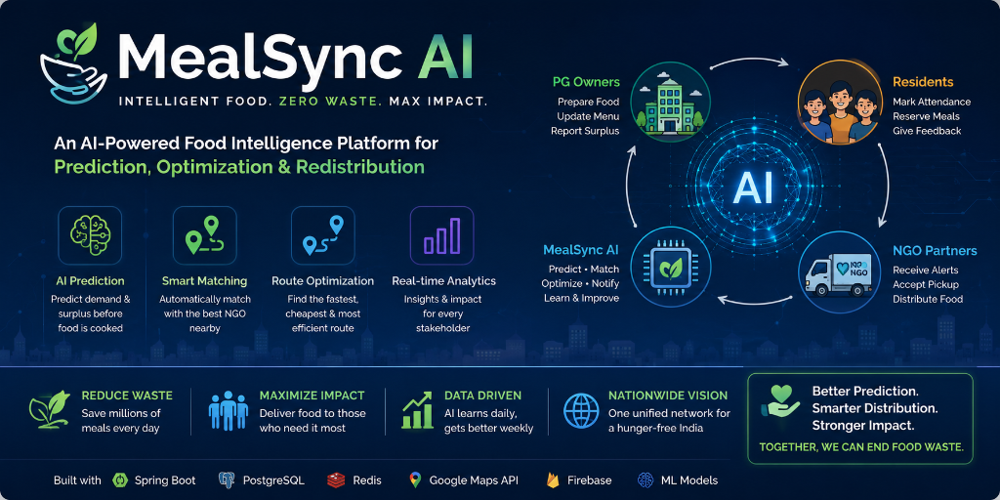
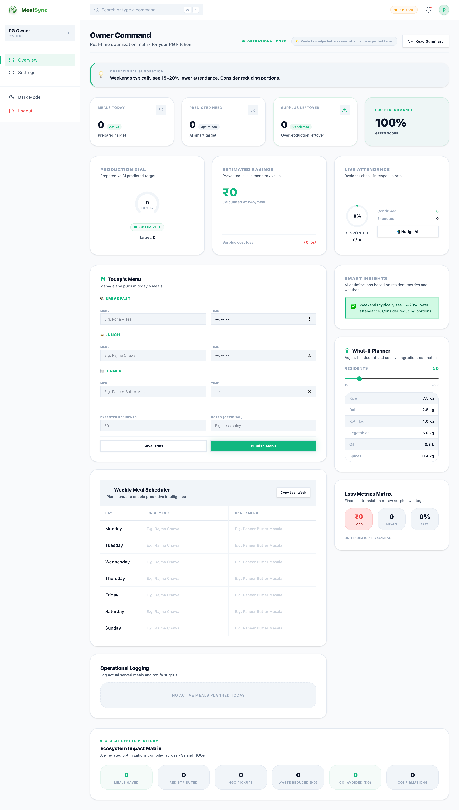
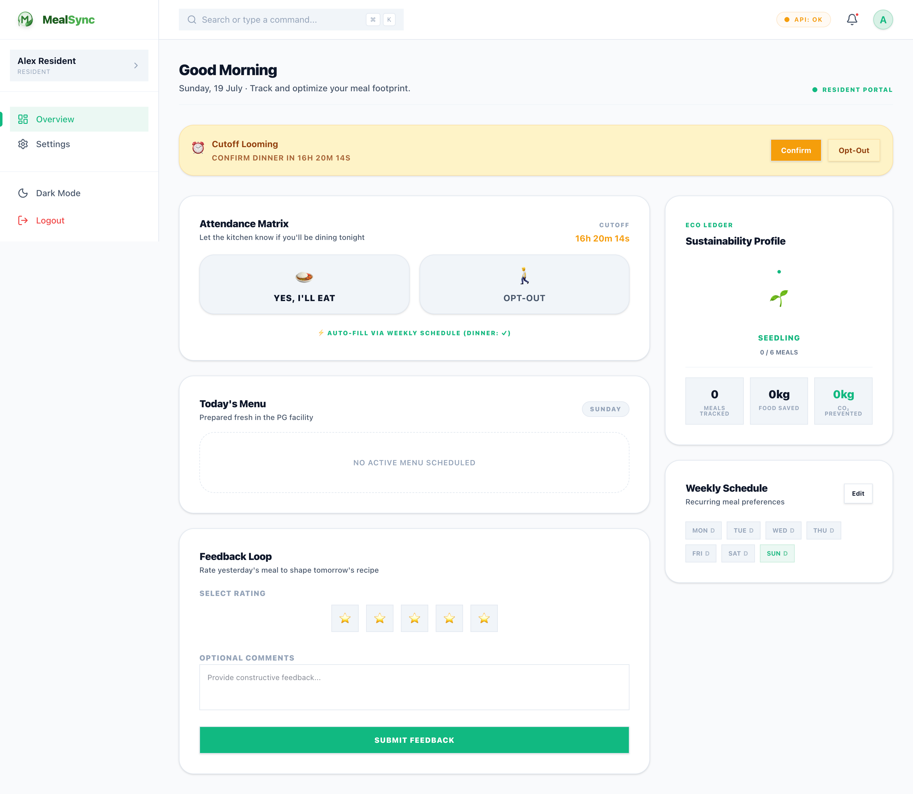
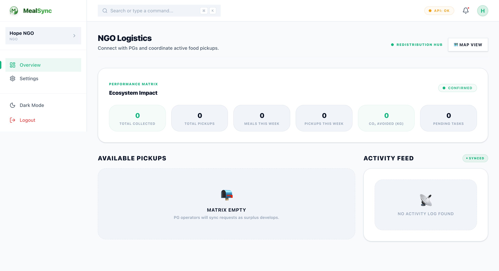
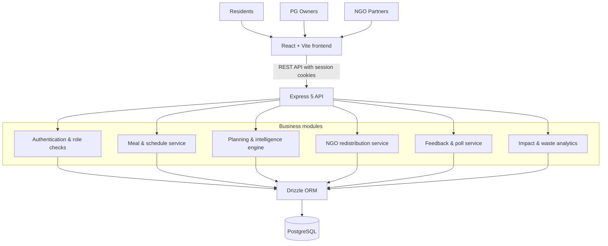
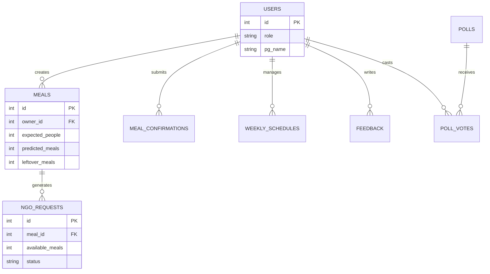
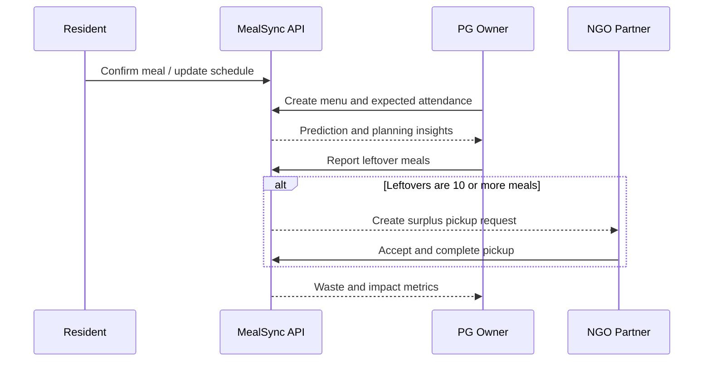

<p align="center">
  
</p>

# 🍽️ MealSync — Intelligent Food Management Platform

> **Intelligent food management and redistribution for shared communities.**
> **Predict. Optimize. Redistribute. Reduce food waste.**

[](https://react.dev/)
[](https://www.typescriptlang.org/)
[](https://expressjs.com/)
[](https://www.postgresql.org/)
[](#license)


🚀 [Live Demo](#) &nbsp;·&nbsp; 📽 [Demo Video](#) &nbsp;·&nbsp; 📖 [API Docs](#)

MealSync is a smart food management and redistribution platform for PGs, hostels, and shared-living communities. It combines resident meal confirmation, demand planning, waste analytics, and automated NGO redistribution in one connected workflow.

**🌱 Reduce waste** &nbsp; **📊 Make data-informed decisions** &nbsp; **🤝 Redistribute surplus food** &nbsp; **📈 Track sustainable impact**

## Table of Contents

- [Core Users](#core-users)
- [Project Highlights](#project-highlights)
- [Feature Overview](#feature-overview)
- [Dashboard Screenshots](#dashboard-screenshots)
- [Why MealSync?](#why-mealsync)
- [Key Features](#key-features)
  - [PG Owner Dashboard](#pg-owner-dashboard)
  - [NGO Dashboard](#ngo-dashboard)
  - [Resident Dashboard](#resident-dashboard)
- [Planning & Intelligence APIs](#planning--intelligence-apis)
- [Intelligence Layer](#intelligence-layer)
- [System Architecture](#system-architecture)
- [Data Model](#data-model)
- [End-to-End Flow](#end-to-end-flow)
- [Tech Stack](#tech-stack)
- [Project Metrics](#project-metrics)
- [Design Principles](#design-principles)
- [Project Structure](#project-structure)
- [Prerequisites](#prerequisites)
- [Getting Started](#getting-started)
  - [Install Dependencies](#1-install-dependencies)
  - [Configure Environment Variables](#2-configure-environment-variables)
  - [Create and Push the Database Schema](#3-create-and-push-the-database-schema)
  - [Start the Backend](#4-start-the-backend)
  - [Start the Frontend](#5-start-the-frontend)
- [Demo Credentials](#demo-credentials)
- [Core Workflow](#core-workflow)
- [Impact Example](#impact-example)
- [Key Commands](#key-commands)
- [Auto-NGO Trigger](#auto-ngo-trigger)
- [Authentication](#authentication)
- [Security](#security)
- [Performance & Developer Experience](#performance--developer-experience)
- [Impact](#impact)
- [Project Vision](#project-vision)
- [Future Improvements](#future-improvements)
- [Built With](#built-with)
- [License](#license)

## Core Users

| User | Purpose |
| --- | --- |
| PG Owners | Plan meals, track demand, monitor waste, and trigger surplus redistribution |
| Residents | Confirm meal attendance, manage weekly schedules, vote in polls, and submit feedback |
| NGOs | View surplus food requests, accept pickups, complete collections, and track impact |

## Project Highlights

- Session-based authentication with role-aware access for owners, residents, and NGO partners
- Type-safe REST APIs built from shared OpenAPI, TypeScript, and Zod contracts
- Automated NGO pickup workflow when reported surplus reaches the configured threshold
- Planning, waste-cost, and sustainability insights for day-to-day kitchen decisions
- PostgreSQL persistence through Drizzle ORM in a pnpm workspace monorepo

## Repository Statistics

| 🏗️ Architecture | 👥 User Roles | 🖥️ Dashboards | 🔌 REST APIs | 🗄️ Database | 💻 Language | ⚙️ API Client |
| :---: | :---: | :---: | :---: | :---: | :---: | :---: |
| **Monorepo** | **3 Roles** | **3 Dashboards** | **20+ Endpoints** | **10+ Tables** | **100% TypeScript** | **OpenAPI Generated** |

## Feature Overview

| 🍽️ Demand Planning | ♻️ Waste Analytics | 🤝 NGO Automation |
| --- | --- | --- |
| Combine attendance signals and expected demand to plan meals with more confidence. | Track leftovers, waste percentage, and estimated cost loss. | Create a surplus pickup request automatically when leftovers meet the threshold. |

| 🗓️ Resident Scheduling | 💬 Community Feedback | 🌱 Impact Tracking |
| --- | --- | --- |
| Let residents maintain a weekly meal schedule and confirm individual meals. | Collect ratings, feedback, and menu preferences through polls. | Surface sustainability signals for residents, owners, NGOs, and the platform. |

## Dashboard Demo

*(A 20–30 second GIF demonstrating the end-to-end flow: Resident confirms meal → Owner dashboard updates → Leftover reported → NGO request appears → Impact updated)*

### PG Owner Dashboard



### Resident Dashboard



### NGO Dashboard



## Why MealSync?

Shared kitchens face a difficult planning problem every day: residents may skip meals, arrive unexpectedly, or change their schedule at the last minute. The result is avoidable food waste, unnecessary cost, and missed opportunities to redirect safe surplus food to nearby communities.

MealSync connects the people and data involved—from resident intent to owner planning and NGO pickup—so each meal can be prepared with more confidence and any surplus can create social impact.

| The challenge | MealSync response |
| --- | --- |
| Uncertain daily attendance | Meal confirmations, schedules, and demand prediction |
| Excess food and cost loss | Leftover logging, waste-cost analytics, and suggestions |
| Disconnected food donation process | Automatic NGO pickup requests once surplus reaches a threshold |
| Little visibility into outcomes | Owner, resident, NGO, and platform impact metrics |

## Key Features

| 👨‍💼 PG Owner | 🤝 NGO Partner | 🏠 Resident |
| --- | --- | --- |
| • Meal input and demand prediction<br>• Leftover tracking & automatic NGO requests<br>• Waste analytics and Green Score<br>• Raw material calculator<br>• Waste-to-cost insights<br>• Smart suggestions based on trends<br>• Global impact tracking | • Real-time surplus food pickup requests<br>• Accept, reject, and confirm pickups<br>• Suggested pickup route ordering<br>• Food details (type, quantity, prep time)<br>• Impact metrics for collected meals<br>• Pickup history and redistribution log | • Meal confirmation system<br>• Weekly schedule editor with auto-fill<br>• Meal reminder banner<br>• Community poll voting<br>• Sustainability impact tracking<br>• Feedback and rating system |

## Planning & Intelligence APIs

MealSync exposes planning and intelligence endpoints for kitchen operations, analytics, and impact tracking.

| Endpoint | Purpose |
| --- | --- |
| `GET /api/intelligence/raw-materials` | Estimate ingredient quantities for today's meals |
| `GET /api/intelligence/waste-cost` | Calculate weekly food waste in monetary terms |
| `GET /api/intelligence/suggestions` | Generate smart suggestions based on patterns and context |
| `GET /api/intelligence/global-impact` | Show aggregate platform impact |
| `GET /api/intelligence/resident-impact` | Show resident-level sustainability impact |
| `GET /api/intelligence/ngo-impact` | Show NGO-level pickup and redistribution impact |
| `POST /api/ngo/requests/:id/complete` | Mark an NGO pickup as completed |
| `GET /api/schedules/mine` | Fetch a resident's weekly meal schedule |
| `POST /api/schedules/mine` | Save a resident's weekly meal schedule |
| `GET /api/polls` | Fetch active community polls |
| `POST /api/polls/:id/vote` | Submit a poll vote |

## Intelligence Layer

### Demand Planning

Owners can record expected attendance and generate a meal prediction before food is prepared. The planning engine also incorporates recorded confirmations into its suggestions, helping owners make smaller, better-informed adjustments.

### Waste & Cost Analytics

MealSync aggregates reported leftovers into a weekly waste view, including waste percentage and estimated cost loss. This turns a vague operational problem into a measurable signal that owners can act on.

### Contextual Suggestions

The suggestions endpoint uses recent leftovers, attendance confirmations, feedback ratings, and weekend context to surface useful prompts—such as reducing portions after repeated surplus or reviewing menu quality after poor ratings.

### Ingredient Planning

Given a menu and planned meal count, the raw-material calculator estimates ingredient quantities to support purchasing and kitchen preparation.

## System Architecture



## Data Model



## End-to-End Flow



## Tech Stack

| Layer | Technology |
| --- | --- |
| Frontend | React, Vite, Tailwind CSS |
| Backend | Express 5 |
| Database | PostgreSQL, Drizzle ORM |
| Validation | Zod, drizzle-zod |
| API Client | OpenAPI + Orval-generated client |
| Charts | Recharts |
| Build Tool | esbuild |
| Monorepo | pnpm workspaces |
| Language | TypeScript |

## Project Metrics

| Metric | Detail |
| --- | --- |
| User roles | 3 — PG owner, resident, and NGO partner |
| Role-specific dashboards | 3 |
| REST operations | 43 across the API route modules |
| Relational tables | 8 PostgreSQL tables |
| Architecture | pnpm workspace monorepo |
| API style | REST with OpenAPI-generated React client |
| Data access | Drizzle ORM with PostgreSQL |
| Language | TypeScript across frontend, backend, and shared libraries |

## Design Principles

- **Modular:** distinct modules cover authentication, meals, schedules, planning, redistribution, feedback, polls, and impact.
- **Type-safe:** shared schemas and generated clients keep API consumers and server contracts aligned.
- **API-first:** OpenAPI-driven integration keeps the frontend and backend independently maintainable.
- **Role-aware:** each dashboard is designed around the operational needs of its user type.
- **Impact-oriented:** every workflow connects kitchen operations to waste reduction and redistribution outcomes.

## Project Structure

```text
MealSync/
├── assets/             # Repository documentation assets
│   ├── mealsync-banner.png
│   └── screenshots/    # PG owner, resident, and NGO dashboard captures
├── artifacts/
│   ├── mealsync/       # React + Vite user interface
│   │   └── src/
│   │       ├── components/  # Shared UI, auth, landing, and map components
│   │       ├── pages/       # Screens and role-specific dashboards
│   │       ├── hooks/       # Reusable React hooks
│   │       └── lib/         # Frontend utilities
│   └── api-server/     # Express REST API and business workflows
│       └── src/
│           ├── controllers/ # Request handlers and business logic
│           ├── routes/      # Express route definitions
│           ├── middlewares/ # HTTP middleware extension point
│           ├── services/    # External integrations
│           ├── models/      # Data access layer
│           └── lib/         # Server utilities and logging
├── lib/
│   ├── db/             # Drizzle schema and database setup
│   ├── api-spec/       # OpenAPI specification
│   ├── api-zod/        # Generated Zod schemas
│   └── api-client-react/ # Type-safe generated React API client
├── scripts/            # Workspace automation and tooling
├── pnpm-workspace.yaml
└── package.json
```

## Prerequisites

- Node.js 24
- pnpm through Corepack
- PostgreSQL running locally or through a hosted database

Enable pnpm with Corepack:

```bash
corepack enable
corepack prepare pnpm@latest --activate
```

If `pnpm` is not available because of system permissions, use `corepack pnpm` in place of `pnpm`.

## Getting Started

### 1. Install Dependencies

```bash
cd MealSync-main
corepack pnpm install
```

### 2. Configure Environment Variables

Set your local database connection before running database or API commands:

```bash
export DATABASE_URL="postgresql://amrishgupta@localhost:5432/mealsync"
export SESSION_SECRET="dev-secret"
```

For another machine or hosted database, replace `DATABASE_URL` with your PostgreSQL connection string.

### 3. Create and Push the Database Schema

Create the database if needed:

```bash
createdb -h localhost mealsync
```

Push the Drizzle schema:

```bash
DATABASE_URL=postgresql://amrishgupta@localhost:5432/mealsync corepack pnpm --filter @workspace/db run push
```

### 4. Start the Backend

Run this in the first terminal:

```bash
DATABASE_URL=postgresql://amrishgupta@localhost:5432/mealsync SESSION_SECRET=dev-secret PORT=3000 corepack pnpm --filter @workspace/api-server run dev
```

The API runs at:

```text
http://localhost:3000/api
```

Health check:

```text
http://localhost:3000/api/healthz
```

### 5. Start the Frontend

Run this in the second terminal:

```bash
PORT=5173 BASE_PATH=/ API_URL=http://localhost:3000 corepack pnpm --filter @workspace/mealsync run dev
```

Open the app:

```text
http://localhost:5173
```

## Demo Credentials

| Role | Email | Password |
| --- | --- | --- |
| PG Owner | `owner@mealsync.com` | `password123` |
| NGO | `ngo@mealsync.com` | `password123` |
| Resident | `resident@mealsync.com` | `password123` |

If the local database is fresh and these users are not present, create three users through the app's register flow: one PG Owner, one NGO, and one Resident.

## Core Workflow

```text
Residents mark attendance
        ↓
System predicts meal demand
        ↓
Owner plans optimized food quantity
        ↓
Leftover food is reported
        ↓
NGO request is created automatically
        ↓
NGO accepts and completes pickup
        ↓
Food waste is reduced and impact is tracked
```

## Impact Example

For a shared community of 100 residents, clearer attendance signals can make a meaningful operational difference:

```text
Without informed planning:  100 meals prepared → 18 meals left over
With MealSync signals:       92 meals prepared →  2 meals left over

Potential reduction in surplus: 16 meals (about 89%)
```

This is an illustrative scenario, not a measured platform-wide result. Actual impact depends on attendance, menu, and operational adoption.

## Key Commands

```bash
corepack pnpm run typecheck
corepack pnpm run build
corepack pnpm --filter @workspace/api-spec run codegen
corepack pnpm --filter @workspace/db run push
```

## Auto-NGO Trigger

When a PG owner reports `10` or more leftover meals using `POST /api/meals/:id/leftover`, MealSync automatically creates an NGO pickup request. The response includes:

```json
{
  "autoNgoTriggered": true
}
```

## Authentication

MealSync uses session-based authentication with `express-session`. API requests include cookies using `credentials: "include"`. The app does not use localStorage for authentication, and protected routes return `401` when the user is not authenticated.

## Security

- HTTP-only session cookies for browser authentication
- Role-aware routes for PG owners, residents, and NGO users
- Request validation through Zod and generated schemas
- Drizzle ORM query construction instead of handwritten SQL
- PostgreSQL row-level security policy tooling for protected meal data
- Request logging that redacts cookie headers

> For production deployment, configure HTTPS and set session cookies to `secure: true`, use a persistent session store, rotate secrets, and restrict CORS to the deployed frontend origin.

## Performance & Developer Experience

- Vite provides a fast frontend development workflow.
- esbuild bundles the API service efficiently.
- OpenAPI and Orval-generated clients keep frontend calls aligned with the API contract.
- Shared TypeScript and Zod schemas reduce integration errors across the monorepo.
- Recharts supports lightweight, interactive dashboard visualizations.

## Impact

- Reduces food waste in PGs and hostels
- Helps owners plan better meal quantities
- Saves operating cost through waste-to-cost visibility
- Supports NGOs with structured surplus food pickup requests
- Builds a measurable sustainability ecosystem

## Project Vision

> MealSync aims to become an intelligent operating system for community kitchens—helping organizations optimize meal planning, minimize waste, and maximize social impact through data-informed decision-making.

## Future Improvements

- [x] Meal confirmation and weekly scheduling
- [x] Leftover tracking and automatic NGO request creation
- [x] Waste, cost, and sustainability impact tracking
- [x] Community polls and resident feedback
- [ ] Real-time notifications using Web Push
- [ ] Live maps and route optimization for NGOs
- [ ] ML-based demand prediction models
- [ ] QR-assisted pickup verification
- [ ] Mobile experience for residents and NGO partners
- [ ] Multi-hostel administration and reporting
- [ ] Carbon-footprint and weather-aware planning

## Built With

- **React**
- **TypeScript**
- **Express**
- **Drizzle ORM**
- **PostgreSQL**
- **OpenAPI**
- **Orval**
- **TailwindCSS**
- **Recharts**

## License

This project is available under the MIT License.
